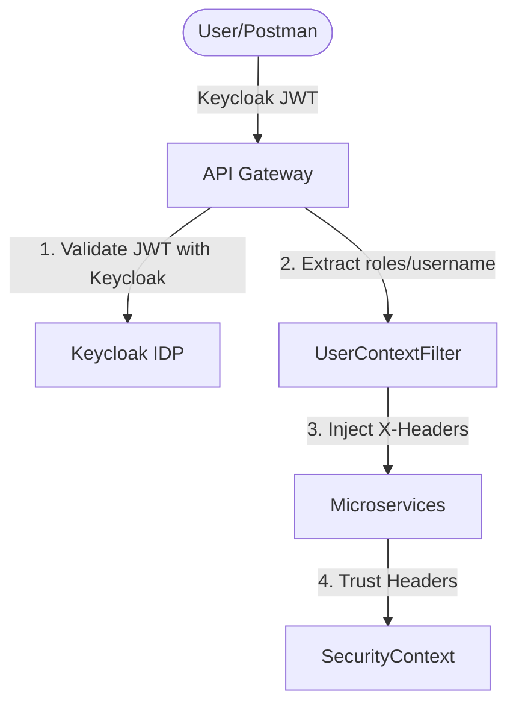

# API Gateway Security Architecture (OAuth 2.0 with Keycloak)

This document describes the "Gateway-Bouncer" security model implemented for the Saga Orchestration Pattern microservices.

## 1. Architecture Overview

The system uses a **Bouncer-Only Edge** pattern. Instead of every microservice validating OAuth 2.0 JWT tokens (which is slow and error-prone in local development), only the API Gateway performs the validation.



## 2. Component breakdown

### A. API Gateway (The Bouncer)
*   **Module**: `api-gateway`
*   **Logic**: `UserContextFilter`
*   **Responsibility**:
    1.  Receives the `Authorization: Bearer <TOKEN>` header.
    2.  Validates the token signature and expiration with Keycloak.
    3.  Extracts user claims (username and roles).
    4.  Injects them as internal HTTP headers:
        *   `X-User-Name`: The authenticated username.
        *   `X-User-Roles`: A comma-separated list of roles (e.g., `ROLE_USER,ROLE_ADMIN`).

### B. Microservices (The Trusted Network)
*   **Modules**: `user-service`, `orders-service`, `products-service`, `payments-service`, `credit-card-processor-service`
*   **Logic**: `HeaderAuthenticationFilter`
*   **Responsibility**:
    1.  Intercepts every incoming request using a custom Spring Filter.
    2.  Reads the `X-User-Name` and `X-User-Roles` headers.
    3.  Creates a `UsernamePasswordAuthenticationToken` and populates the `SecurityContextHolder`.
    4.  Allows you to use standard Spring Security features like `@PreAuthorize`.

## 3. Configuration

### Gateway (`application.yml`)
```yaml
spring:
  security:
    oauth2:
      resourceserver:
        jwt:
          jwk-set-uri: http://localhost:9091/realms/saga-realm/protocol/openid-connect/certs
```

### Microservices (`application.properties`)
```properties
# Custom properties to identify headers
gateway.trusted.header.username=X-User-Name
gateway.trusted.header.roles=X-User-Roles
```

## 4. Usage in Controllers

Once a request passes through the Gateway, the user's identity is automatically available in your Controllers:

```java
@GetMapping("/test-security")
public String testSecurity(Principal principal) {
    // principal is automatically populated by HeaderAuthenticationFilter
    return "Authenticated user: " + principal.getName();
}

@PostMapping("/admin-only")
@PreAuthorize("hasRole('ADMIN')")
public String adminAction() {
    return "Secret admin operation successful";
}
```

## 5. Security Benefits
1.  **Zero-Network Overhead**: Microservices don't need to call Keycloak to validate every request.
2.  **Solves 401 Identity Issues**: Eliminates local environment certificate/issuer issues by centralizing validation.
3.  **Unified Context**: The identity of the user flows seamlessly across the entire microservice mesh.
