# Saga Pattern Microservices Architecture

This diagram illustrates the complete infrastructure, observability stack, and microservices layer you have successfully configured.

```mermaid
flowchart TD
    %% ----- STYLES -----
    classDef client fill:#fcfcfc,stroke:#333,stroke-width:2px,color:#000
    classDef edge fill:#ffd54f,stroke:#f57f17,stroke-width:2px,color:#000
    classDef svc fill:#64b5f6,stroke:#0d47a1,stroke-width:2px,color:#fff
    classDef data fill:#81c784,stroke:#1b5e20,stroke-width:2px,color:#fff
    classDef infra fill:#9e9e9e,stroke:#424242,stroke-width:2px,color:#fff
    classDef event fill:#ba68c8,stroke:#4a148c,stroke-width:2px,color:#fff

    %% ----- CLIENT -----
    Client([Client App / Postman]):::client

    %% ----- EDGE LAYER -----
    subgraph EdgeLayer ["1. Edge & Security Layer"]
        Keycloak["Keycloak (Port 9091)<br/>OAuth 2.0 Identity"]:::edge
        Gateway["API Gateway (Port 8080)<br/>Routing & Filtering"]:::edge
    end

    %% ----- CORE BUSINESS LAYER -----
    subgraph CoreLayer ["2. Business Microservices Layer"]
        UserSvc["User Service"]:::svc
        OrderSvc["Orders Service"]:::svc
        ProductSvc["Products Service"]:::svc
        PaymentSvc["Payments Service"]:::svc
        CCPSvc["Credit Card Processor"]:::svc
        
        %% Synchronous Business Logic
        PaymentSvc -.->|Sync HTTP Call| CCPSvc
    end

    %% ----- PERSISTENCE & MESSAGING -----
    subgraph PersistenceLayer ["3. Data & Event Storage"]
        MySQL[("MySQL<br/>DB Volumes")]:::data
        Redis[("Redis<br/>Cache/Session Volumes")]:::data
        Kafka{{"Kafka Broker<br/>Saga Event Bus"}}:::event
    end

    %% ----- OBSERVABILITY & REGISTRY -----
    subgraph InfraLayer ["4. Registry & Observability"]
        Eureka["Eureka Server<br/>Service Registry"]:::infra
        Prometheus["Prometheus<br/>Metrics Scraper"]:::infra
        Zipkin["Zipkin<br/>Distributed Traces"]:::infra
        Grafana["Grafana<br/>Viz Dashboards"]:::infra
    end

    %% ----- HIERARCHICAL CONNECTIONS -----

    %% 1. Client to Edge
    Client -->|1. Login| Keycloak
    Client -->|2. Secure Request| Gateway
    Gateway <-->|Validate JWT| Keycloak

    %% 2. Edge to Core
    Gateway -->|Routes via Eureka| UserSvc & OrderSvc & ProductSvc & PaymentSvc

    %% 3. Core to Persistence/Messaging (Reduced line clutter)
    UserSvc & OrderSvc & ProductSvc & PaymentSvc --> MySQL & Redis
    OrderSvc & ProductSvc & PaymentSvc <-->|Publish/Subscribe| Kafka

    %% 4. Observability Links (Abstracted logically to keep graph clean)
    Prometheus -->|Scrapes Actuator| CoreLayer
    Prometheus -->|Scrapes Actuator| EdgeLayer
    Grafana -->|Pulls Data| Prometheus
    
    CoreLayer -.->|Sends Spans| Zipkin
    EdgeLayer -.->|Sends Spans| Zipkin
    
    CoreLayer -.->|Registers| Eureka
    EdgeLayer -.->|Registers| Eureka

```

### Why this structure is better:
1. **Top-Down Flow**: You can physically read the request flow from top to bottom (Client ➔ Edge ➔ Microservices ➔ Data).
2. **Reduced Spaghetti Lines**: Instead of drawing 30 intersecting lines from every service to Eureka/MySQL/Prometheus, it abstracts the monitoring and tracking to the layer level, making the diagram vastly easier to read.
3. **Data Isolation**: The persistence mechanisms and Kafka orchestration are grouped properly away from the control plane tools (Zipkin/Eureka), preventing visual confusion.
