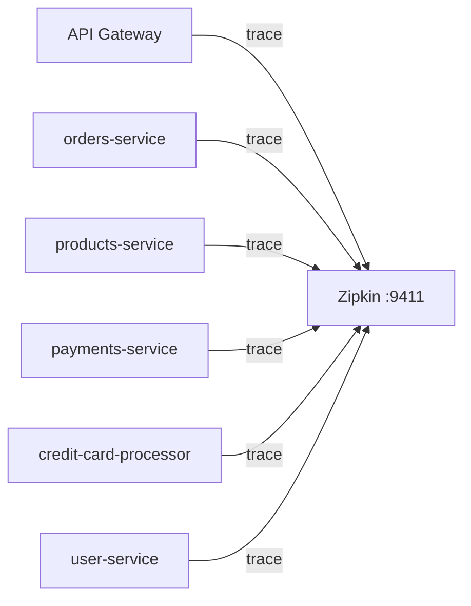

# Zipkin & Redis Integration Summary

## Overview
Integrated **Zipkin** (distributed tracing) and **Redis** (caching/session store) across all microservices in the Saga Pattern demo.

## Changes Made

### 1. Docker Compose — Infrastructure Services (already done)
| Service | Image | Port |
|---------|-------|------|
| Zipkin | `openzipkin/zipkin:latest` | `9411` |
| Redis | `redis:latest` | `6379` |

### 2. Maven Dependencies Added

Added to **all services** (except `user-service` which already had them):

| Dependency | Purpose |
|-----------|---------|
| `io.micrometer:micrometer-tracing-bridge-brave` | Bridges Micrometer Tracing to Brave |
| `io.zipkin.reporter2:zipkin-reporter-brave` | Reports traces to Zipkin |
| `org.springframework.boot:spring-boot-starter-data-redis` | Redis auto-configuration |

**Services updated:**
- ✅ `orders-service` — [pom.xml](file:///c:/Users/Devi%20T/IdeaProjects/saga-pattern-spring-boot-demo/orders-service/pom.xml)
- ✅ `products-service` — [pom.xml](file:///c:/Users/Devi%20T/IdeaProjects/saga-pattern-spring-boot-demo/products-service/pom.xml)
- ✅ `payments-service` — [pom.xml](file:///c:/Users/Devi%20T/IdeaProjects/saga-pattern-spring-boot-demo/payments-service/pom.xml)
- ✅ `credit-card-processor-service` — [pom.xml](file:///c:/Users/Devi%20T/IdeaProjects/saga-pattern-spring-boot-demo/credit-card-processor-service/pom.xml)
- ✅ `api-gateway` — [pom.xml](file:///c:/Users/Devi%20T/IdeaProjects/saga-pattern-spring-boot-demo/api-gateway/pom.xml)
- ✅ `user-service` — Already had dependencies

### 3. Application Configuration

Added to each service's [application.properties](file:///c:/Users/Devi%20T/IdeaProjects/saga-pattern-spring-boot-demo/api-gateway/src/main/resources/application.properties):

```properties
# Zipkin Distributed Tracing
management.tracing.sampling.probability=1.0
management.zipkin.tracing.endpoint=http://localhost:9411/api/v2/spans

# Redis Configuration
spring.data.redis.host=localhost
spring.data.redis.port=6379
```

### 4. Docker Compose — Environment Overrides

Added to every microservice in [docker-compose.yml](file:///c:/Users/Devi%20T/IdeaProjects/saga-pattern-spring-boot-demo/docker-compose.yml):

```yaml
environment:
  MANAGEMENT_ZIPKIN_TRACING_ENDPOINT: http://zipkin:9411/api/v2/spans
  SPRING_DATA_REDIS_HOST: redis
depends_on:
  - zipkin
  - redis
```

> [!NOTE]
> The env vars `MANAGEMENT_ZIPKIN_TRACING_ENDPOINT` and `SPRING_DATA_REDIS_HOST` override the `localhost` defaults in [application.properties](file:///c:/Users/Devi%20T/IdeaProjects/saga-pattern-spring-boot-demo/api-gateway/src/main/resources/application.properties) when running inside Docker, pointing to the container hostnames `zipkin` and `redis`.

## How It Works

### Zipkin Tracing Flow


- **Sampling probability**: `1.0` (100% — all requests traced during dev)
- **Zipkin UI**: [http://localhost:9411](http://localhost:9411)

### Redis Connectivity
- **Local dev**: `localhost:6379`
- **Docker**: Container hostname `redis:6379` (overridden via `SPRING_DATA_REDIS_HOST`)
